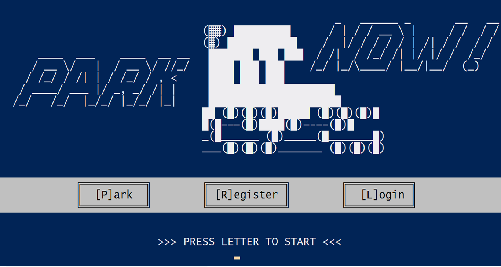

# Park Now

Park Now is a simple app which can be used to look for parkinglots.

## Techonologies Used
- Ruby
- CSV as database.

## Features

#### 1. Registration
- Parking lot owner shall register first to be able to use the app. 
#### 2. Login
- Only registered user can login to the app and use the app features.
#### 3. Search Lots
- Parking lots can be search thru the park page. Drivers don't need to register to search for parking lots.
#### 4. Update Parking Information
- Registered owner can update parking lot information. Each parking lot has its unique code and it will be used to identify which parking lot to be updated.
#### 5. Update Parking Space
- Owners can updated parking spaces if there are vehicle(in and out).
#### 6. View List Parked Vehicles.
- Owners can monitor or see the list of parked vehicles.
#### 7. Add New Parking Lot
- Onwers can add new parking lots if he or she has available lot.
#### 8. Logout